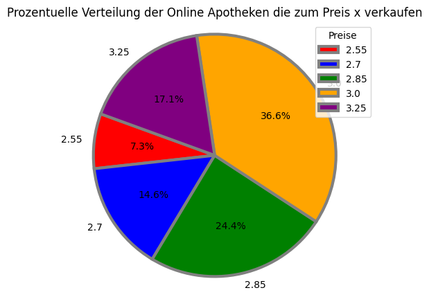

# Univariante Analyse am Beispiel der Online Apotheken
### Es werden die Preise für ein Medikament in verschiedenen Online Apotheken untersucht.

#### Bei der Untersuchung wird folgendes analysiert:
* Die Absolute Häufigkeit (grafische Darstellung)
* Die Relative Häufigkeit (grafische Darstellung)
* Die Prozentuale Verteilung (grafische Darstellung)
* Der Median
* Der Mittelwert
* Die mittlere zentrale Abweichung
* Der innere Quartilsabstand


```python
import numpy as np
import matplotlib.pyplot as plt
import pandas as pd
from scipy.stats import median_abs_deviation
```


```python
df = pd.DataFrame ({'Preis (xi)': [2.55,2.70,2.85,3.00,3.25], 'Apotheken (hi)': [3,6,10,15,7]})
```

#### Der DataFrame zeigt die Anzahl der Online Apotheken die zu einem Preise (xi) verkaufen.


```python
df
```


<div>

<table border="1" class="dataframe">
  <thead>
    <tr style="text-align: right;">
      <th></th>
      <th>Preis (xi)</th>
      <th>Apotheken (hi)</th>
    </tr>
  </thead>
  <tbody>
    <tr>
      <th>0</th>
      <td>2.55</td>
      <td>3</td>
    </tr>
    <tr>
      <th>1</th>
      <td>2.70</td>
      <td>6</td>
    </tr>
    <tr>
      <th>2</th>
      <td>2.85</td>
      <td>10</td>
    </tr>
    <tr>
      <th>3</th>
      <td>3.00</td>
      <td>15</td>
    </tr>
    <tr>
      <th>4</th>
      <td>3.25</td>
      <td>7</td>
    </tr>
  </tbody>
</table>
</div>


```python
preis = df['Preis (xi)']
anzahl = df['Apotheken (hi)']
 
y_pos = np.arange(len(preis))

bar_labels = ['red', 'blue', 'purple', 'orange','orange']
bar_colors = ['tab:red', 'tab:blue', 'tab:green', 'tab:orange','tab:purple']
plt.bar(y_pos, anzahl, align='center', label=bar_labels, color=bar_colors)
plt.xticks(y_pos, preis)
plt.ylabel('(absolute) Häufigkeit')
plt.xlabel('Preise')
plt.title('Absoluter Anteil der Online Apotheken die zum Preis x verkaufen')
plt.legend(title="Preise")

plt.tick_params(
    axis='x',
    which='both',
    bottom=False
)
plt.show()
```


    

    


```python
fi_rel = df['Apotheken (hi)'] / df['Apotheken (hi)'].sum()
df['Relative Häufigkeit (fi)'] = fi_rel
df['Absolute Häufigkeit (Hi)'] = df['Apotheken (hi)'].cumsum()
Fi_rel = df['Relative Häufigkeit (fi)'].cumsum()
df['Relative Häufigkeit (Fi)'] = Fi_rel
df
```


<div>

<table border="1" class="dataframe">
  <thead>
    <tr style="text-align: right;">
      <th></th>
      <th>Preis (xi)</th>
      <th>Apotheken (hi)</th>
      <th>Relative Häufigkeit (fi)</th>
      <th>Absolute Häufigkeit (Hi)</th>
      <th>Relative Häufigkeit (Fi)</th>
    </tr>
  </thead>
  <tbody>
    <tr>
      <th>0</th>
      <td>2.55</td>
      <td>3</td>
      <td>0.073171</td>
      <td>3</td>
      <td>0.073171</td>
    </tr>
    <tr>
      <th>1</th>
      <td>2.70</td>
      <td>6</td>
      <td>0.146341</td>
      <td>9</td>
      <td>0.219512</td>
    </tr>
    <tr>
      <th>2</th>
      <td>2.85</td>
      <td>10</td>
      <td>0.243902</td>
      <td>19</td>
      <td>0.463415</td>
    </tr>
    <tr>
      <th>3</th>
      <td>3.00</td>
      <td>15</td>
      <td>0.365854</td>
      <td>34</td>
      <td>0.829268</td>
    </tr>
    <tr>
      <th>4</th>
      <td>3.25</td>
      <td>7</td>
      <td>0.170732</td>
      <td>41</td>
      <td>1.000000</td>
    </tr>
  </tbody>
</table>
</div>


```python
preis = df['Preis (xi)']
anzahl = df['Relative Häufigkeit (fi)']
 
y_pos = np.arange(len(preis))

bar_labels = ['red', 'blue', 'purple', 'orange','orange']
bar_colors = ['tab:red', 'tab:blue', 'tab:green', 'tab:orange','tab:purple']
plt.bar(y_pos, anzahl, align='center', label=bar_labels, color=bar_colors)
plt.xticks(y_pos, preis)
plt.ylabel('(relative) Häufigkeit')
plt.xlabel('Preise')
plt.title('Relativer Anteil der Online Apotheken die zum Preis x verkaufen')
plt.legend(title="Preise")

plt.tick_params(
    axis='x',
    which='both',
    bottom=False
)
plt.show()
```


    

    


```python
preis = df['Preis (xi)']
rel = df['Relative Häufigkeit (fi)'] * 100
apotheken = df['Apotheken (hi)']
colors = ("red", "blue", "green", "orange", "purple") 
fig, ax  = plt.subplots(figsize=(6, 5))
ax.pie(apotheken,
    labels = preis, startangle = 160, autopct = '%.1f%%',wedgeprops = {'linewidth' : 3, 'edgecolor' : "grey" }, colors=colors)

ax.axis('equal')
ax.set_title("Prozentuelle Verteilung der Online Apotheken die zum Preis x verkaufen") 
plt.legend(title="Preise")
plt.show()
```


    

    


```python
df.head()
```


<div>

<table border="1" class="dataframe">
  <thead>
    <tr style="text-align: right;">
      <th></th>
      <th>Preis (xi)</th>
      <th>Apotheken (hi)</th>
      <th>Relative Häufigkeit (fi)</th>
      <th>Absolute Häufigkeit (Hi)</th>
      <th>Relative Häufigkeit (Fi)</th>
    </tr>
  </thead>
  <tbody>
    <tr>
      <th>0</th>
      <td>2.55</td>
      <td>3</td>
      <td>0.073171</td>
      <td>3</td>
      <td>0.073171</td>
    </tr>
    <tr>
      <th>1</th>
      <td>2.70</td>
      <td>6</td>
      <td>0.146341</td>
      <td>9</td>
      <td>0.219512</td>
    </tr>
    <tr>
      <th>2</th>
      <td>2.85</td>
      <td>10</td>
      <td>0.243902</td>
      <td>19</td>
      <td>0.463415</td>
    </tr>
    <tr>
      <th>3</th>
      <td>3.00</td>
      <td>15</td>
      <td>0.365854</td>
      <td>34</td>
      <td>0.829268</td>
    </tr>
    <tr>
      <th>4</th>
      <td>3.25</td>
      <td>7</td>
      <td>0.170732</td>
      <td>41</td>
      <td>1.000000</td>
    </tr>
  </tbody>
</table>
</div>


#### Die describe() Methode gibt verschiedene statische Werte aus.

##### Der Median für das Medikament beträgt 2.87 Euro. Somit haben 50 % der Kunden für weniger und 50 % der Kunden mehr als 2.87 Euro für das Medikament bezahlt.

##### Der günstigste Preis der Online Apotheken ist 2.55 Euro für das Medikament. Während der höchste Preis bei 3.25 Euro liegt.


```python
df.describe()
```


<div>

<table border="1" class="dataframe">
  <thead>
    <tr style="text-align: right;">
      <th></th>
      <th>Preis (xi)</th>
      <th>Apotheken (hi)</th>
      <th>Relative Häufigkeit (fi)</th>
      <th>Absolute Häufigkeit (Hi)</th>
      <th>Relative Häufigkeit (Fi)</th>
    </tr>
  </thead>
  <tbody>
    <tr>
      <th>count</th>
      <td>5.000000</td>
      <td>5.000000</td>
      <td>5.000000</td>
      <td>5.000000</td>
      <td>5.000000</td>
    </tr>
    <tr>
      <th>mean</th>
      <td>2.870000</td>
      <td>8.200000</td>
      <td>0.200000</td>
      <td>21.200000</td>
      <td>0.517073</td>
    </tr>
    <tr>
      <th>std</th>
      <td>0.270647</td>
      <td>4.549725</td>
      <td>0.110969</td>
      <td>16.130716</td>
      <td>0.393432</td>
    </tr>
    <tr>
      <th>min</th>
      <td>2.550000</td>
      <td>3.000000</td>
      <td>0.073171</td>
      <td>3.000000</td>
      <td>0.073171</td>
    </tr>
    <tr>
      <th>25%</th>
      <td>2.700000</td>
      <td>6.000000</td>
      <td>0.146341</td>
      <td>9.000000</td>
      <td>0.219512</td>
    </tr>
    <tr>
      <th>50%</th>
      <td>2.850000</td>
      <td>7.000000</td>
      <td>0.170732</td>
      <td>19.000000</td>
      <td>0.463415</td>
    </tr>
    <tr>
      <th>75%</th>
      <td>3.000000</td>
      <td>10.000000</td>
      <td>0.243902</td>
      <td>34.000000</td>
      <td>0.829268</td>
    </tr>
    <tr>
      <th>max</th>
      <td>3.250000</td>
      <td>15.000000</td>
      <td>0.365854</td>
      <td>41.000000</td>
      <td>1.000000</td>
    </tr>
  </tbody>
</table>
</div>


##### Die Spannweite des Preises streut in einem Interval von 70 Cent
##### Die Spannweite der anbietenden Online Apotheken streut in einem Intervall von 12


```python
spannweite_preis = df['Preis (xi)'].max() - df['Preis (xi)'].min()
print(spannweite_preis)
spannweite_apotheken = df['Apotheken (hi)'].max() - df['Apotheken (hi)'].min()
print(spannweite_apotheken)
```

    0.7000000000000002
    12


##### Die mittlere absolute Abweichung der Online Apothekenpreise beträgt 15 Cent für das Medikament.
##### Somit weichen die Preise durchschnittlich 15 Cent vom arithmetischen Mittel ab.
##### Die Abweichung beträgt 5 % und ist damit sehr gering.


```python
print(df[['Preis (xi)']].apply(median_abs_deviation))
mad = df[['Preis (xi)']].apply(median_abs_deviation) / df['Preis (xi)'].mean()
print(mad)
```
```bash
Preis (xi)    0.15
dtype: float64
Preis (xi)    0.052265
dtype: float64
```


##### Der Interquartilsabstand beträgt 30 Cent
##### Die mittleren 50% der Apotheken bieten das Medikament zwischen 2.70 Euro und 3.00 Euro an.


```python
q75, q25 = np.percentile(df['Preis (xi)'], [75 ,25])
print(q75,q25)
iqr = q75 - q25
iqr
```
```bash
3.0 2.7
0.2999999999999998
```